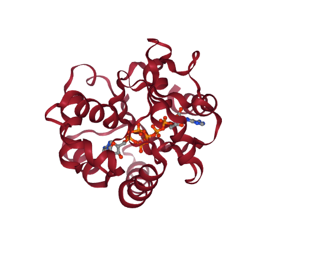
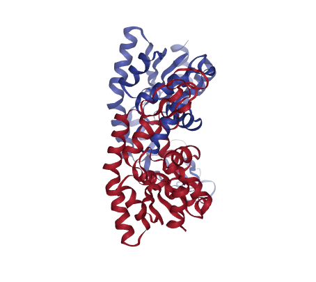
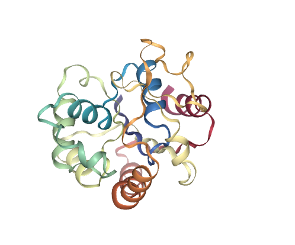
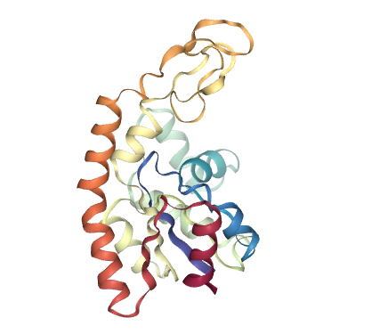

# Protein Conformational Transitions calculations tutorial using BioExcel Building Blocks (biobb) and GOdMD

***
This tutorial aims to illustrate the process of computing a **conformational transition** between two known **structural conformations** of a protein, step by step, using the **BioExcel Building Blocks library (biobb)**. 

Examples shown are the calculation of the conformational transition for the **Adenylate Kinase** protein, from the **closed state** (PDB Code [1AKE](https://www.rcsb.org/structure/1AKE)) to the **open state** (PDB Code [4AKE](https://www.rcsb.org/structure/4AKE)). **Adenylate Kinases** are **phosphotransferase enzymes** that catalyze the interconversion of the various **adenosine phosphates** (ATP, ADP, and AMP), and are known to undergo large **conformational changes** during their **catalytic cycle**.

The code wrapped is the ***GOdMD*** method, developed in the **[Molecular Modeling and Bioinformatics](https://mmb.irbbarcelona.org/www/) group** (IRB Barcelona). **GOdMD** determines pathways for **conformational transitions** in macromolecules using **discrete molecular dynamics** and **biasing techniques** based on a combination of **essential dynamics** and **Maxwell-Demon sampling techniques**. A web implementation of the method can be found here: https://mmb.irbbarcelona.org/GOdMD/index.php

**Exploration of conformational transition pathways from coarse-grained simulations.**<br>
*Sfriso P, Hospital A, Emperador A, Orozco M.*<br>
*Bioinformatics, 129(16):1980-6.*<br>
*Available at: https://doi.org/10.1093/bioinformatics/btt324*

***

## Settings

### Biobb modules used

 - [biobb_godmd](https://github.com/bioexcel/biobb_godmd): Tools to compute protein conformational transitions using GOdMD.
 - [biobb_io](https://github.com/bioexcel/biobb_io): Tools to fetch biomolecular data from public databases.
 - [biobb_structure_utils](https://github.com/bioexcel/biobb_structure_utils): Tools to modify or extract information from a PDB structure.
 - [biobb_analysis](https://github.com/bioexcel/biobb_analysis): Tools to analyse Molecular Dynamics trajectories.
  
### Auxiliar libraries used

 - [nb_conda_kernels](https://github.com/Anaconda-Platform/nb_conda_kernels): Enables a Jupyter Notebook or JupyterLab application in one conda environment to access kernels for Python, R, and other languages found in other environments.
 - [ipywidgets](https://github.com/jupyter-widgets/ipywidgets): Interactive HTML widgets for Jupyter notebooks and the IPython kernel.
 - [nglview](https://nglviewer.org/#nglview): Jupyter/IPython widget to interactively view molecular structures and trajectories in notebooks.
 - [plotly](https://plotly.com/python/): Python Open Source Graphing Library. 
 - [simpletraj](https://github.com/arose/simpletraj): Lightweight coordinate-only trajectory reader based on code from GROMACS, MDAnalysis and VMD.


### Conda Installation and Launch

```console
git clone https://github.com/bioexcel/biobb_wf_godmd.git
cd biobb_wf_godmd
conda env create -f conda_env/environment.yml
conda activate biobb_wf_godmd
jupyter-nbextension enable --py --user widgetsnbextension
jupyter-notebook biobb_wf_godmd/notebooks/biobb_wf_godmd.ipynb
  ``` 

***
## Pipeline steps
 1. [Input Parameters](#input)
 2. [Fetching Structures](#fetch)
 3. [Preparing Structures](#preparing)
 3. [Residue Mapping](#mapping)
 4. [Conformational Transition](#godmd)
 5. [Transition Visualization](#trajectory)
 6. [Questions & Comments](#questions)
 
***


***

<a id="input"></a>
## Input parameters
**Input parameters** needed:
 - **Auxiliar libraries**: Libraries to be used in the workflow are imported once at the beginning
 
 
 - **pdbOrigin**: PDB code for the origin structure (e.g. 1AKE)
 - **chainOrigin**: Chain for the origin structure (e.g. A)
 - **ligandOrigin**: Ligand (if present) for the origin structure (e.g. AP5) 
 
 
 - **pdbTarget**: PDB code for the target structure (e.g. 4AKE)
 - **chainTarget**: Chain for the target structure (e.g. A)
 - **ligandTarget**: Ligand (if present) for the target structure (e.g. None)


```python
import os
import plotly
import plotly.graph_objs as go
import nglview
import ipywidgets

# Adenylate Kinase (ADK)
pdbOrigin = "1ake" 
chainOrigin = "A"
ligandOrigin = "AP5"

pdbTarget = "4ake" 
chainTarget = "A"
ligandTarget = None

# Other Examples (taken from https://mmb.irbbarcelona.org/TransAtlas/)

# Estrogen Receptor Alpha (ERα)
# pdbOrigin = "1a52" 
# pdbTarget = "3dt3" 
# chainOrigin = "A"
# chainTarget = "B"
# ligandOrigin = "EST"
# ligandTarget = "369"

# Calmodulin (CaM)
# pdbOrigin = "1deg" 
# pdbTarget = "2f2o" 
# chainOrigin = "A"
# chainTarget = "A"
# ligandOrigin = None
# ligandTarget = None
```

<a id="fetch"></a>
***
## Fetching PDB structures
Downloading **PDB structures** with the origin and target **protein molecules** from the RCSB PDB database.<br>
Alternatively, **PDB files** can be used as starting structures. <br>
***
**Building Blocks** used:
 - [Pdb](https://biobb-io.readthedocs.io/en/latest/api.html#module-api.pdb) from **biobb_io.api.pdb**
***


```python
# Import module
from biobb_io.api.pdb import pdb

# Create properties dict and inputs/outputs
originPDB = pdbOrigin+'.pdb'
targetPDB = pdbTarget+'.pdb'

prop_origin = {
    'pdb_code': pdbOrigin,
    'filter': False
}

prop_target = {
    'pdb_code': pdbTarget,
    'filter': False
}

# Launch bb for Origin PDB
pdb(output_pdb_path=originPDB,
    properties=prop_origin)

# Launch bb for Target PDB
pdb(output_pdb_path=targetPDB,
    properties=prop_target)
```

<a id="vis3D"></a>
### Visualizing 3D structures
Visualizing the downloaded/given **PDB structures** using **NGL**: 


```python
# Show different structures (for comparison)

view1 = nglview.show_structure_file(originPDB)
#view1.add_representation(repr_type='ball+stick')
view1._remote_call('setSize', target='Widget', args=['400px','400px'])
view1.camera='orthographic'
view1
view2 = nglview.show_structure_file(targetPDB)
#view2.add_representation(repr_type='ball+stick')
view2._remote_call('setSize', target='Widget', args=['400px','400px'])
view2.camera='orthographic'
view2
ipywidgets.HBox([view1, view2])
```

</img></img>

<a id="preparing"></a>
***
## Preparing the structures
Preparing the **structures** to be used for the **conformational transition** calculation. 
- Extracting the interesting **chains** from the **PDB structures** (chain A in both cases).
- Removing the **inhibitor** AP5A from the **closed conformation**. 
***
**Building Blocks** used:
 - [extract_chain](https://biobb-structure-utils.readthedocs.io/en/stable/utils.html#module-utils.extract_chain) from **biobb_structure_utils.utils.extract_chain**
 - [remove_molecules](https://biobb-structure-utils.readthedocs.io/en/stable/utils.html#module-utils.remove_molecules) from **biobb_structure_utils.utils.remove_molecules**
 
***

Extracting the interesting **chains** from the **PDB structures** (chain A in both cases).


```python
from biobb_structure_utils.utils.extract_chain import extract_chain

originPDB_chain = pdbOrigin + ".chains.pdb"
targetPDB_chain = pdbTarget + ".chains.pdb"

prop = {
    'chains': [ chainOrigin ]
}


# Launch bb for Origin PDB
extract_chain(
    input_structure_path=originPDB,
    output_structure_path=originPDB_chain,
    properties=prop
)

prop = {
    'chains': [ chainTarget ]
}

# Launch bb for Target PDB
extract_chain(
    input_structure_path=targetPDB,
    output_structure_path=targetPDB_chain,
    properties=prop
)
```

Removing the **inhibitor** AP5A from the **closed conformation**. 


```python
from biobb_structure_utils.utils.remove_molecules import remove_molecules

originPDB_chain_nolig = pdbOrigin + ".chains.nolig.pdb"
targetPDB_chain_nolig = pdbTarget + ".chains.nolig.pdb"

if ligandOrigin:
    prop = {
        'molecules': [
            {
                'name' : ligandOrigin
            }
        ]
    }
    remove_molecules(input_structure_path=originPDB_chain,
                     output_molecules_path=originPDB_chain_nolig,
                     properties=prop)
else:
    originPDB_chain_nolig = originPDB_chain

if ligandTarget:
    prop = {
        'molecules': [
            {
                'name' : ligandTarget
            }
        ]
    }
    remove_molecules(input_structure_path=targetPDB_chain,
                     output_molecules_path=targetPDB_chain_nolig,
                     properties=prop)
else:
    targetPDB_chain_nolig = targetPDB_chain

```

<a id="vis3D_chains"></a>
### Visualizing 3D structures
Visualizing the modified **PDB structures** using **NGL**: 


```python
# Show different structures generated (for comparison)

view1 = nglview.show_structure_file(originPDB_chain_nolig)
#view1.add_representation(repr_type='ball+stick')
view1._remote_call('setSize', target='Widget', args=['400px','400px'])
view1.camera='orthographic'
view1
view2 = nglview.show_structure_file(targetPDB_chain_nolig)
#view2.add_representation(repr_type='ball+stick')
view2._remote_call('setSize', target='Widget', args=['400px','400px'])
view2.camera='orthographic'
view2
ipywidgets.HBox([view1, view2])
```

</img></img>

<a id="mapping"></a>
***
## Computing the mapping
**GOdMD** works by moving the atoms from the position of the **origin structure** to the one in the **target structure**. For that, a one-to-one correspondance is needed. This step builds a couple of **mapping files** (.aln) from an internal **sequence alignment** (using ***[EMBOSS water](https://www.ebi.ac.uk/Tools/psa/emboss_water/)*** pairwise sequence alignment tool).     
***
**Building Blocks** used:
 - [godmd_prep](https://biobb-godmd.readthedocs.io/en/latest/godmd.html#module-godmd.godmd_prep) from **biobb_godmd.godmd.godmd_prep**
 
***


```python
from biobb_godmd.godmd.godmd_prep import godmd_prep

originALN = pdbOrigin + ".aln"
targetALN = pdbTarget + ".aln"

prop = {
    'gapopen' : '12.0',
    'gapextend' : '2'
}

godmd_prep( input_pdb_orig_path=originPDB_chain_nolig,
            input_pdb_target_path=targetPDB_chain_nolig,
            output_aln_orig_path=originALN,
            output_aln_target_path=targetALN,
            properties=prop)
```

<a id="godmd"></a>
***
## Running GOdMD 
Computing the **conformational transition**, from the **origin** to the **target** structure, using **GOdMD** and the **mappings** generated in the previous step. The output file is a **trajectory file** in **mdcrd** format.
    
***
**Building Blocks** used:
 - [godmd_run](https://biobb-godmd.readthedocs.io/en/latest/godmd.html#module-godmd.godmd_run) from **biobb_godmd.godmd.godmd_run**
 
***


```python
from biobb_godmd.godmd.godmd_run import godmd_run

godmd_log = pdbOrigin + "-" + pdbTarget + ".godmd.log"
godmd_trj = pdbOrigin + "-" + pdbTarget + ".godmd.mdcrd"
godmd_ene = pdbOrigin + "-" + pdbTarget + ".godmd.ene.out"

prop = {
    'godmdin':{
        'temp' : 400
    }
}

godmd_run(   input_pdb_orig_path=originPDB_chain_nolig,
             input_pdb_target_path=targetPDB_chain_nolig,
             input_aln_orig_path=originALN,
             input_aln_target_path=targetALN,
             output_log_path=godmd_log,
             output_ene_path=godmd_ene,
             output_trj_path=godmd_trj,
             properties=prop)

```

<a id="dcd"></a>
***
## Converting trajectory to DCD (visualization)
Converting the generated **GOdMD trajectory** from the **mdcrd** format to a **dcd** format, for the sake of visualization with **NGL** (see next cell).<br> <br>
***
**Building Blocks** used:
 - [cpptraj_convert](https://biobb-analysis.readthedocs.io/en/latest/ambertools.html#module-ambertools.cpptraj_convert) from **biobb_analysis.ambertools.cpptraj_convert**
***


```python
from biobb_analysis.ambertools.cpptraj_convert import cpptraj_convert

godmd_trj_dcd = pdbOrigin + "-" + pdbTarget + ".godmd.dcd"
reference_pdb = "reference.pdb"

prop = {
    'format': 'dcd'
}

cpptraj_convert(input_top_path=reference_pdb,
                input_traj_path=godmd_trj,
                output_cpptraj_path=godmd_trj_dcd,
                properties=prop)

```

***
<a id="trajectory"></a>
## Visualizing trajectory
Visualizing the **GOdMD** computed **conformational transition** using **NGL**. The scene shows the **origin** (tube, blue) and **target** (tube, red) structure for reference. 

***


```python
# Show trajectory

view = nglview.show_simpletraj(nglview.SimpletrajTrajectory(godmd_trj_dcd, reference_pdb), gui=True)

view.add_representation(repr_type='tube', colorScheme = 'atomindex')

# Origin Structure
b = view.add_component(originPDB_chain_nolig)
b.clear_representations()
b.add_representation(repr_type='tube',
                        opacity=.2,
                        color='blue')

# Target Structure
c = view.add_component(targetPDB_chain_nolig)
c.clear_representations()
c.add_representation(repr_type='tube', 
                       opacity=.2,
                        color='red')

# Align origin and target
code = """
var stage = this.stage;
var clist_len = stage.compList.length;
var i = 0;
var s = [];
for(i = 0; i <= clist_len; i++){
    if(stage.compList[i] != undefined && stage.compList[i].structure != undefined) {        
       s.push(stage.compList[i])
    }
}
NGL.superpose(s[1].structure, s[2].structure, true, ".CA")
s[ 1 ].updateRepresentations({ position: true })
s[ 1 ].autoView()
"""

view._execute_js_code(code)

view._remote_call('setSize', target='Widget', args=['800px','600px'])
view
```

</img>

***
<a id="questions"></a>

## Questions & Comments

Questions, issues, suggestions and comments are really welcome!

* GitHub issues:
    * [https://github.com/bioexcel/biobb](https://github.com/bioexcel/biobb)

* BioExcel forum:
    * [https://ask.bioexcel.eu/c/BioExcel-Building-Blocks-library](https://ask.bioexcel.eu/c/BioExcel-Building-Blocks-library)

